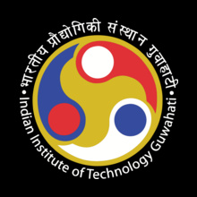

<h1 align="center">Hi 👋, I'm Ashish Chadha</h1>
<h3 align="center">A passionate first-year student at IIT Guwahati</h3>

  

- 👀 I’m interested in **AI/ML and Data Science**  
- 🌱 I’m currently learning **Data Science and Machine Learning**  
- 😄 Pronouns: **He/Him**  
- ⚡ Fun fact: **We develop code and create AI tools that generate code for us.**  

---

## **💻 AI Model Deployment & APIs**  
I work with **local AI models** and **APIs** to build AI applications.  

| Ollama | LM Studio | Hugging Face | OpenAI API | Gemini API |  
|--------|----------|--------------|------------|------------|  
|  |  |  |  |  |

---

## **Connect with me:**  

  

---

## **🛠️ Languages and Tools:**  

 
   
   
   
   
   

<!---
AshChadha-iitg/AshChadha-iitg is a ✨ special ✨ repository because its `README.md` (this file) appears on your GitHub profile.
You can click the Preview link to take a look at your changes.
--->
<!---
AshChadha-iitg/AshChadha-iitg is a ✨ special ✨ repository because its `README.md` (this file) appears on your GitHub profile.
You can click the Preview link to take a look at your changes.
--->
<!---
AshChadha-iitg/AshChadha-iitg is a ✨ special ✨ repository because its `README.md` (this file) appears on your GitHub profile.
You can click the Preview link to take a look at your changes.
--->
